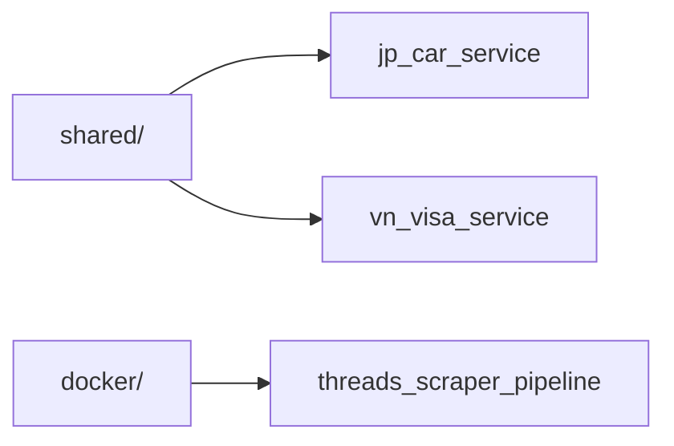

# Threads Audience Discovery Stack

這個 repo 用來整理與執行 Threads 公開貼文資料蒐集流程，現在有兩條主題型資料蒐集路徑，以及一套獨立的 Airflow 排程環境。


## Repo Overview

| 路徑 | 角色 | 主要入口 |
|---|---|---|
| `shared/` | 共用模組 | `shared/threads_client.py`, `shared/keyword_monitor.py` |
| `jp_car_service/` | 日本包車 / 接送主題資料蒐集 | `jp_car_service/threads_post_scraper_car_service.ipynb` |
| `vn_visa_service/` | 越南簽證 / 快速通關主題資料蒐集 | `vn_visa_service/threads_post_scraper_vn_visa.ipynb`, `vn_visa_service/threads_post_scraper_vn_visa_backfill_range.py` |
| `docker/` | 本地 Airflow 排程環境 | `docker/docker-compose.yaml`, `docker/airflow/dags/threads_scraper_pipeline.py` |



說明：
- `jp_car_service/` 與 `vn_visa_service/` 走 notebook / script 路徑，依賴 `shared/`。
- `docker/` 內的 Airflow DAG 使用自己的 `etl_lib/` 模組，不直接依賴 `shared/`。

## How To Start

### Path A: Notebook

適用情境：
- 手動驗證關鍵字
- 調整資料清洗或匯出流程
- 先確認輸出，再決定是否排程化

開始方式：
1. 安裝依賴：`pip install -r jp_car_service/requirements.txt` 或 `pip install -r vn_visa_service/requirements.txt`
2. 準備對應目錄的 `.env`
3. 開啟 notebook 執行

入口檔案：
- `jp_car_service/threads_post_scraper_car_service.ipynb`
- `vn_visa_service/threads_post_scraper_vn_visa.ipynb`

### Path B: Backfill Script

適用情境：
- 補抓特定日期區間資料

入口檔案：
- `vn_visa_service/threads_post_scraper_vn_visa_backfill_range.py`

執行方式：

```bash
python vn_visa_service/threads_post_scraper_vn_visa_backfill_range.py
```

### Path C: Airflow

適用情境：
- 需要固定排程
- 需要 DAG 任務編排與執行監控

啟動方式：

```bash
cd docker
docker compose up airflow-init
docker compose up -d
```

檢查狀態：

```bash
docker compose ps
```

Web UI：
- `http://localhost:8082`

## Shared Modules

`shared/` 目前有兩個共用模組，提供給 notebook / script 路徑重用。

### `shared/threads_client.py`

角色：
- 封裝 ScrapeCreators Threads API client
- 定義標準化資料結構 `ThreadsPost`、`ThreadsProfile`
- 提供 CSV / JSON 匯出工具

實作：
- `get_profile(handle)`
- `get_user_posts(handle)`
- `get_post(url)`
- `search_posts(query, start_date, end_date, trim=False)`
- `search_users(query)`
- `get_credit_balance()`
- `posts_to_dicts(posts)`
- `save_csv(posts, filepath)`
- `save_json(data, filepath)`

資料輸出：
- `posts_to_dicts()` 會將 `ThreadsPost` 轉成平面結構
- 匯出欄位包含 `post_id`、`username`、互動數、`permalink`、`timestamp`
- 另有保留原始 `taken_at` 欄位供後續資料處理使用

### `shared/keyword_monitor.py`

角色：
- 以 `ThreadsClient` 為基礎執行多關鍵字搜尋
- 管理跨輪次去重、結果累積、統計與匯出

實作：
- `search_keyword(keyword, start_date, end_date)`
- `run_round(keywords, start_date, end_date, existing_post_ids=None)`
- `run_adaptive(keywords, ..., min_rounds=2, max_rounds=5, dup_threshold=0.7)`
- `export_results(prefix="threads")`
- `print_summary()`

實作特徵：
- 以 `post_id` 去重
- 支援預載 `existing_post_ids`，供既有資料去重使用
- `run_adaptive()` 會依 `dup_ratio` 動態決定是否提前停止搜尋

## Required Config

以下只列出目前程式碼中可直接驗證到的設定來源。

| 設定 | 驗證依據 | 使用範圍 |
|---|---|---|
| `SCRAPECREATORS_API_KEY` | `shared/threads_client.py` 直接讀取環境變數 | `shared/`, `jp_car_service/`, `vn_visa_service/`, `docker/` |
| `.env` | `jp_car_service` notebook、`vn_visa_service` notebook、`vn_visa_service` backfill script 會載入 `.env` | notebook / script 路徑 |
| `ANTHROPIC_API_KEY` | `docker/docker-compose.yaml` | `docker/` |
| `GMAIL_APP_PASSWORD` | `docker/docker-compose.yaml` | `docker/` |
| Google credential 檔 | repo 內存在 `*.json` 憑證檔，`docker/docker-compose.yaml` 也設定 `GOOGLE_APPLICATION_CREDENTIALS` | 依各流程需要 |

`SCRAPECREATORS_API_KEY` 可用 shell env 或 `.env` 提供。

PowerShell：

```powershell
$env:SCRAPECREATORS_API_KEY="your_key_here"
```

Bash：

```bash
export SCRAPECREATORS_API_KEY="your_key_here"
```

`.gitignore` 目前已忽略：
- `*.json`
- `.env`
- `.env.*`

## Outputs

notebook 輸出位置：
- `jp_car_service/data/`
- `vn_visa_service/data/`

Airflow 執行輸出：
- container 內路徑：`/opt/airflow/output`
- Docker volume：`airflow-output`

## Docs Index

- [shared/README.md](</i:\Fnte Workdir\threads-audience-discovery-stack\shared\README.md>)
- [jp_car_service/README.md](</i:\Fnte Workdir\threads-audience-discovery-stack\jp_car_service\README.md>)
- [vn_visa_service/README.md](</i:\Fnte Workdir\threads-audience-discovery-stack\vn_visa_service\README.md>)
- [docker/AIRFLOW_SCHEDULE_DESIGN.md](</i:\Fnte Workdir\threads-audience-discovery-stack\docker\AIRFLOW_SCHEDULE_DESIGN.md>)

## Scope

這份 README 只回答四件事：
- 這個 repo 有哪些模組
- 每條路徑從哪裡開始
- 啟動前要準備哪些設定
- 更細的規則要去看哪份文件
