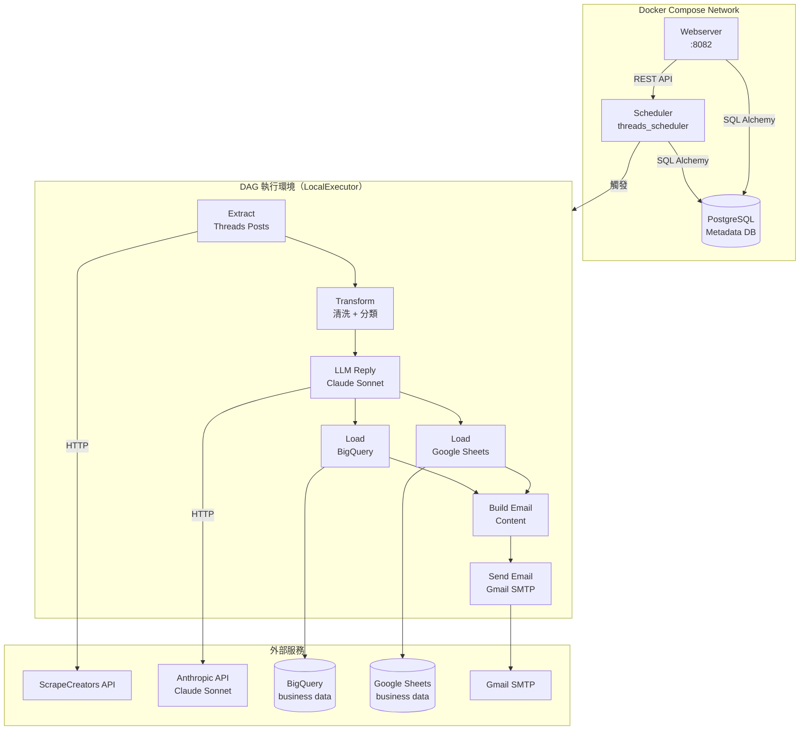
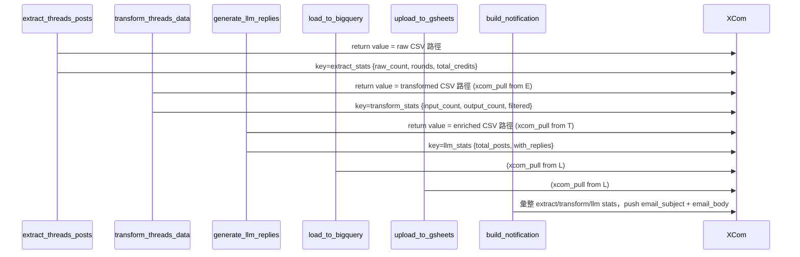

# Airflow 排程設計與執行方式

> 適用版本：Apache Airflow 2.9.2 / Docker Compose (LocalExecutor)
> 更新日期：2026-04-02

---

## 1. 整體架構

本專案以 Docker Compose 啟動一組最小化 Airflow 環境，採用 **LocalExecutor**，讓 Task 可並行執行，同時避免引入 Celery / Redis 等額外元件。

### 1.1 容器清單

| 容器名稱 | 映像 | 角色 | 記憶體上限 |
|---|---|---|---|
| `threads_postgres` | postgres:17-alpine | Airflow Metadata DB（僅存排程狀態，不存業務資料）| 128 MB |
| `threads_scheduler` | apache/airflow:2.9.2 | DAG 解析、任務排隊、執行 | 512 MB |
| `threads_webserver` | apache/airflow:2.9.2 | Web UI（port 8082） | 256 MB |
| `airflow-init` | apache/airflow:2.9.2 | 一次性初始化（DB migrate、建立管理員帳號），結束後退出 | — |

> **業務資料儲存**：BigQuery（長期儲存）+ Google Sheets（即時檢視），與 PostgreSQL 完全分離。

### 1.2 架構示意圖



---

## 2. 排程設定

### 2.1 Cron 表達式

```
schedule='0 10,14,18 * * *'
```

- **時區**：`Asia/Taipei`（UTC+8），由 `AIRFLOW__CORE__DEFAULT_TIMEZONE` 設定
- **觸發時間**：每日 **10:00、14:00、18:00**（共 3 次）
- **catchup**：`False`（不補跑歷史排程）
- **max_active_runs**：`1`（同時最多 1 個 DAG Run，避免資源競爭）

### 2.2 增量抓取窗口邏輯

每次執行對應不同的時間過濾窗口，實現全天增量覆蓋：

| 執行時間 | API 查詢範圍 | 過濾窗口 |
|---|---|---|
| 10:00 | d-1 ～ today | 00:00 ～ 10:00 |
| 14:00 | today | 10:00 ～ 14:00 |
| 18:00 | today | 14:00 ～ 18:00 |

---

## 3. DAG：`threads_scraper_pipeline`

### 3.1 Task 依賴鏈

```
extract_threads_posts
    └─► transform_threads_data
            └─► generate_llm_replies
                    ├─► load_to_bigquery ──┐
                    └─► upload_to_gsheets ─┤
                                           └─► build_notification
                                                   └─► send_notification_email
```

`load_to_bigquery` 與 `upload_to_gsheets` 為**並行**執行（fan-out），完成後才匯合進入通知任務。

### 3.2 各 Task 說明

| Task ID | Operator | 功能 | 注意事項 |
|---|---|---|---|
| `extract_threads_posts` | PythonOperator | 呼叫 ScrapeCreators API，動態輪數爬蟲（min 2 輪，max 5 輪），BQ post_id 去重，輸出 CSV | dup_threshold=0.7，超過門檻停止增輪 |
| `transform_threads_data` | PythonOperator | 清洗文字、正則意圖分類（包車/接送）、過濾商家廣告文 | 商家詞清單維護於 `threads_config.yaml` |
| `generate_llm_replies` | PythonOperator | 呼叫 Claude Sonnet 生成情緒標籤（sentiment）+ 建議回覆；無資料時 skip | execution_timeout=15 min；batch_size=8 |
| `load_to_bigquery` | PythonOperator | WRITE_APPEND 模式上傳到 BQ `social_media.threads_posts` | 無資料時自動 skip |
| `upload_to_gsheets` | PythonOperator | 覆蓋寫入 Google Sheets，欄位依設定過濾 | clear_first=True，每次全量覆蓋當批資料 |
| `build_notification` | PythonOperator | 從 XCom 彙整各 Task 統計，組合 HTML Email 內文 | — |
| `send_notification_email` | EmailOperator | 透過 Gmail SMTP (port 587/STARTTLS) 發送執行報告 | — |

### 3.3 Task 間資料傳遞（XCom）



> **中繼檔案路徑**：`/opt/airflow/output/`（對應 host 的 `./airflow/output/`），檔名帶 batch_date 與 HHMM，供各 Task 順序讀取。

---

## 4. 錯誤處理與重試

```python
default_args = {
    'retries': 2,
    'retry_delay': timedelta(minutes=5),
    'email_on_failure': True,
    'depends_on_past': False,
}
```

| 機制 | 設定值 | 說明 |
|---|---|---|
| 自動重試 | 2 次 | 每次失敗等候 5 分鐘再重試 |
| 失敗 Email | 開啟 | 任一 Task 失敗立即通知 `rex.chan@fnte.com.tw` |
| depends_on_past | False | 前一天失敗不影響今天執行 |
| max_active_runs | 1 | 防止多個 Run 同時執行造成 API 超量消耗 |

---

## 5. 環境變數與憑證

所有敏感值透過 `.env` 注入，不得 hardcode。

| 變數 | 用途 |
|---|---|
| `ANTHROPIC_API_KEY` | Claude API 呼叫 |
| `SCRAPECREATORS_API_KEY` | Threads 爬蟲 API |
| `GMAIL_APP_PASSWORD` | Gmail SMTP 寄信 |
| `GOOGLE_APPLICATION_CREDENTIALS` | BQ 服務帳號金鑰路徑（container 內） |

**Volume 掛載：**

```yaml
volumes:
  - ./airflow/dags:/opt/airflow/dags          # DAG 程式碼 (即時生效)
  - ./airflow/logs:/opt/airflow/logs          # Task 執行日誌
- ./airflow/config:/opt/airflow/config      # GCP 金鑰
  - ./airflow/plugins:/opt/airflow/plugins
  - ./airflow/output:/opt/airflow/output      # Task 中繼 CSV
```

---

## 6. 常用操作指令

### 啟動環境

```bash
cd docker/

# 首次啟動（含 DB 初始化）
docker compose up airflow-init && docker compose up -d

# 後續啟動
docker compose up -d
```

### 確認服務健康狀態

```bash
docker compose ps
# 確認 threads_scheduler 與 threads_webserver 狀態為 healthy
```

### 手動觸發 DAG（不等排程）

```bash
# 方法 1：CLI
docker exec threads_scheduler airflow dags trigger threads_scraper_pipeline

# 方法 2：Web UI
# 開啟 http://localhost:8082，登入後點擊 DAG → Trigger DAG ▶
```

### 查看 Task 日誌

```bash
docker exec threads_scheduler airflow tasks logs threads_scraper_pipeline extract_threads_posts <run_id>
```

### 停止環境

```bash
docker compose down           # 保留 postgres volume（資料不刪）
docker compose down -v        # 連 volume 一起清除（Airflow metadata 全部重置）
```

---

## 7. 設定檔維護

業務邏輯（關鍵字、商家詞、BQ 設定等）集中在：

```
docker/airflow/dags/etl_lib/configs/threads_config.yaml
```

修改後**無需重啟容器**，DAG 下次執行時自動讀取最新值（`_load_config()` 每次 Task 執行時重新載入）。

---

## 8. 資源消耗估算

| 項目 | 估算 |
|---|---|
| 容器總記憶體峰值 | ~896 MB（scheduler 512 + webserver 256 + postgres 128）|
| 每次執行 API Credits | 依關鍵字數 × 爬蟲輪數，min_rounds=2, max_rounds=5 |
| LLM 費用 | Claude Sonnet，batch_size=8，每批最多 4096 tokens output |
| 每日執行次數 | 3 次（10:00 / 14:00 / 18:00）|
