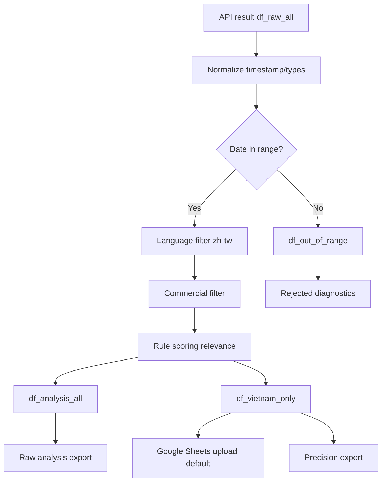

# `threads_post_scraper_visa.ipynb` 優化計劃（H3 API 模糊比對）

## 摘要
- 目標：在 API 模糊比對（fuzzy matching）前提下，把 notebook 產出改為「雙軌輸出」：`raw_all` + `vietnam_only`，且預設上傳 `vietnam_only`。
- 已決策：`雙軌輸出`、`只改 notebook`、`精準優先`（`non-target <= 30%` 且日期外樣本 `= 0`）、判定方法採規則打分（rule scoring）。
- 本計劃只涵蓋 `threads_post_scraper_visa.ipynb`，不動 `backfill_range.py`。

## 事實依據（含逐字引文）
- Notebook 逐字引文：`ScrapeCreators API 採模糊比對...改以 post_category 標記分類`。
- Notebook 逐字引文：`# 日期範圍過濾 ...` 整段目前為註解狀態。
- CSV 實測（`threads_vietnam_visa_backfill_20260401_20260415.csv`）：
  - 總筆數 `178`
  - 日期外樣本 `6` 筆（`3.37%`）
  - `post_category` 分布：`越南簽證/快速通關 72`、`其他 70`、`主題樂園快速通關 31`、`泰國快速通關 5`
  - `search_keyword=越南簽證` literal 命中率僅 `29.87%`（`54` 筆未含「越南簽證」字面）
  - 現行 `is_commercial` 全為 `False`，但額外訊號可抓到約 `17.98%` 疑似商業文

## 實作變更（Notebook 內）
1. 建立單一設定區塊（config block）
- `VIETNAM_TERMS`、`VISA_TERMS`、`NOISE_TERMS`、`COMMERCIAL_TERMS_EXTENDED`、`QUALITY_TARGETS`
- `QUALITY_TARGETS = {"max_non_target_ratio": 0.30, "max_out_of_range_ratio": 0.0}`

2. 重構資料流（data flow）
- `df_raw_all`：API 去重後原始集
- `df_norm_all`：型別/時間標準化
- `df_in_range` + `df_out_of_range`：所有模式都執行日期硬過濾
- `df_lang_clean`：繁中過濾
- `df_non_commercial` + `df_commercial`：商業文過濾（用 `re.escape` 組 pattern）
- `df_scored`：加入 `has_vietnam_term`、`has_visa_term`、`has_noise_term`、`relevance_score`、`reject_reason`
- `df_vietnam_only`：精準集
- `df_analysis_all`：保留非商業全量分析集

3. 規則打分（rule scoring）固定規格
- `+2`：命中 `VIETNAM_TERMS`
- `+1`：命中 `VISA_TERMS`
- `+1`：`post_category == 越南簽證/快速通關`
- `-2`：命中 `NOISE_TERMS` 且未命中 `VIETNAM_TERMS`
- `is_vietnam_relevant = relevance_score >= 2`

4. 雙軌輸出與上傳
- 輸出三組檔案：
  - `threads_vietnam_visa_raw_all_{ts}.csv/json`
  - `threads_vietnam_visa_vietnam_only_{ts}.csv/json`
  - `threads_vietnam_visa_rejected_{ts}.csv`
- Google Sheets 預設上傳來源改為 `df_vietnam_only`
- 保留 `is_empty_sheet` 判斷（已能把 `[[]]` 視為空表）
- 增加 `UPLOAD_SOURCE = "vietnam_only" | "analysis_all"`（預設 `vietnam_only`）

5. Notebook 執行一致性
- 移除舊變數 `x_df` 隱性依賴，統一命名
- 上傳前加欄位與非空檢查，避免 `NameError` 與空上傳

## 架構圖（Mermaid）

## 測試與驗收（verification loops）
- 回放測試資料：`threads_vietnam_visa_backfill_20260401_20260415.csv`
- 驗收條件（acceptance criteria）：
  - `out_of_range_ratio == 0`（`vietnam_only` 與 `analysis_all` 都成立）
  - `non_target_ratio(vietnam_only) <= 0.30`
  - `Run All` 無 `NameError`（尤其 `df_clean/x_df`）
  - `UPLOAD_SOURCE=vietnam_only` 時，上傳欄位完整且筆數 > 0
- 以現有 CSV 推估，套用本規則後可達 `non-target` 顯著下降且日期外樣本歸零

## 假設
- ScrapeCreators `search` 的 `start_date/end_date` 仍可能漏篩，故 notebook 必須做二次日期硬過濾
- 本階段不改 `backfill_range.py`
- 不導入 LLM 二次分類，先以可解釋規則為主
